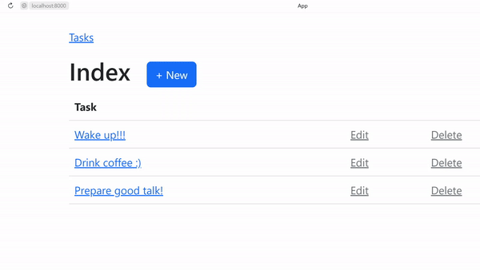

# TODO-list by IHP

## Intro

Here you may find **TODO-list full-stack application** ~~implemented~~ generated with [**IHP**](https://ihp.digitallyinduced.com/), web framework for Haskell.

It has basic **CRUD** operations, renders **HTML** as a response, uses built-in [**Postgres**](https://ihp.digitallyinduced.com/Guide/database.html) server as a storage, and additionally implements a simple custom **logger middleware**.

The main goal of this project is to provide a basic example of implementing web app with IHP framework. In particular, to show how (mostly generated) code looks, and to demonstrate how custom middleware could be added.
So to make life a bit easier for (future) Haskell web developers. It's already pretty easy with IHP, though :wink:

This code complements the talk "How to Choose a Haskell Web Framework" I presented at [Haskell eXchange 2022](https://skillsmatter.com/skillscasts/18103-how-to-choose-a-haskell-web-framework).

[](image.png)

[](image.png)

In this talk, I show how some of Haskell web tools approach web development. In particular, there are 3 of them — Servant, Yesod and IHP.

**There are also corresponding [Servant](https://github.com/alyoanton9/todo-list-servant) and [Yesod](https://github.com/alyoanton9/todo-list-yesod) TODO-list implementations.**

**Check out the [presentation slides](https://drive.google.com/file/d/17K6s0V3C2qL_dy82EzGH29vmmRqBjcUj/view?usp=sharing) and the [talk recording](https://drive.google.com/file/d/1phbv3ghdMDjGTvOCU5Xw3St2Zzv2ZBNt/view?usp=sharing), and [contact me](https://www.linkedin.com/in/alyoanton/) if you have any questions** 🙂 

## API

As application is intended to have just basic CRUD operations, only generated API is used, and here it is

- `GET /Tasks` — get all tasks
- `POST /NewTask` — create new task
- `GET /ShowTask?taskId={id}` — get existing task by `id`
- `PUT /EditTask?taskId={id}` — update existing task by `id`
- `DELETE /DeleteTask?taskId={id}` — delete existing task by `id`

### Web app demo

Here is how task creation, deletion and update may look like.

[](image.png)

## Custom logger middleware

Simple logger here just extracts request’s URL path and logs it with "Info" verbosity level.

For example,

```shell
[Info] url-path=Tasks
[Info] url-path=ShowTask
[Info] url-path=Tasks
[Info] url-path=NewTask
[Info] url-path=Tasks
[Info] url-path=DeleteTask
```

## Prerequisites

- [Nix](https://nixos.org/)

## Run

To run the app, simply start the development server
```shell
> ./start
IHP> Server started
...
```

---
Hope you'll find it helpful :blue_heart:
